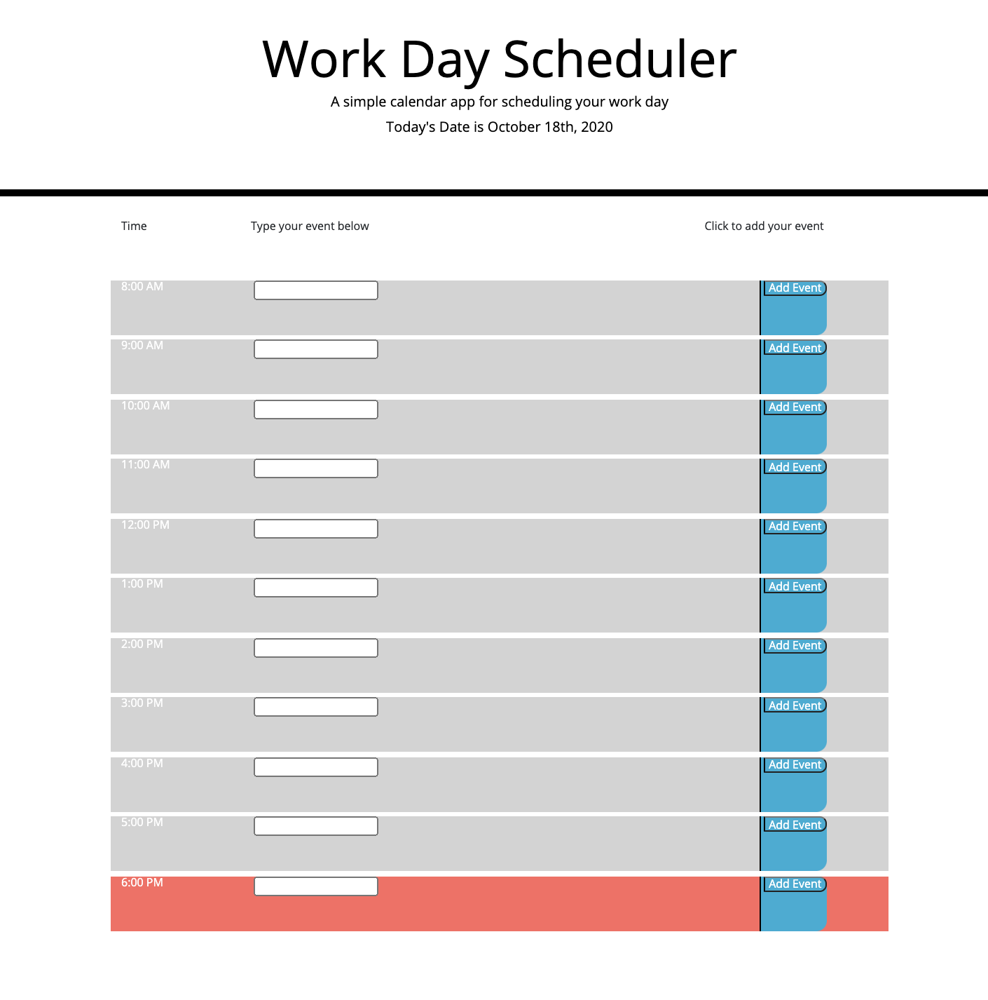

# Ioding

## Homework 5: Calendar

### This weeks homework involved:
* creating a calendar application that displays a day planner
* gives user the ability to input an event that saves to local storage
* the program will display past hours as gray, future hours as green, and the current hour as red

### Issues
* events do not save to local storage
* console.log shows the click function loops through twice per click, could not figure out why this happens

#### Deployed Webpage
* image taken at 6:58 PM October 18th, 2020
